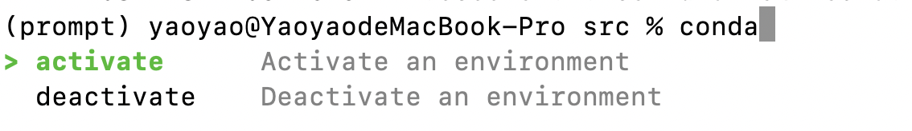

# EasyCommands

Welcome to EasyCommands, a tool for IDE-style autocompletion across multiple oprating systems.



## Setup

Install deps:

```bash
cd EasyCommands/src/
npm i -D tsx
npm install .
```

## Usage

```bash
# within EasyCommands dir
cd EasyCommands/
npx tsx src/index.ts
```

Type `conda` and a space to see the options, enjoy!

## TODO

- Detect space to show suggestions
- Add more commands to spec
- Add scripts to spec
